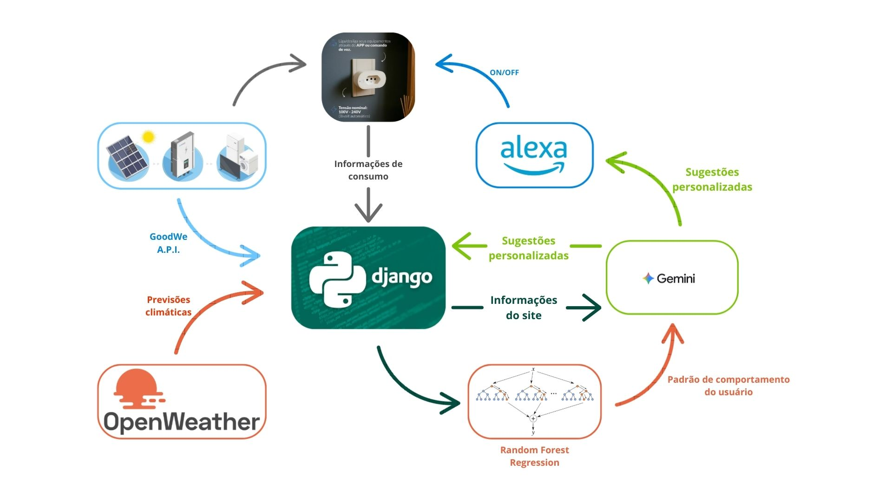

# ⚡ EnerVision – Smart Energy Management Ecosystem

EnerVision é um ecossistema completo para **monitoramento, previsão e controle inteligente de energia**, integrando:

- Django como núcleo do sistema
- API da GoodWe para geração fotovoltaica
- Tomadas inteligentes para coleta de consumo
- API da OpenWeather para previsões climáticas
- Random Forest Regression para identificar padrões de comportamento do usuário
- Google Gemini para gerar recomendações personalizadas
- Integração com **assistentes virtuais (Alexa e Google Home)** para automação e comandos de voz

Tudo isso em uma plataforma web responsiva, com gráficos, histórico e recomendações inteligentes para otimização do consumo de energia.

---

## 🚀 Funcionalidades

- 📊 **Dashboard em tempo real**: geração fotovoltaica, consumo por dispositivo, previsões climáticas.  
- 🧠 **IA para padrões de consumo**: identifica quando e como o usuário mais consome energia.  
- 💡 **Sugestões inteligentes**: recomenda desligar ou ligar aparelhos em horários ideais para reduzir desperdícios.  
- 🎙️ **Integração com Alexa/Google Home**: consulte as sugestões por voz ou deixe que a assistente configure automaticamente os dispositivos.  
- 🌐 **Acesso via web**: histórico, gráficos, previsões e relatórios completos.  
- ☁️ **Hospedagem na nuvem** (Heroku inicialmente, escalável para servidores próprios da empresa).  

---

## 🛠️ Tecnologias Utilizadas

- **Backend**: Django (Python)  
- **Frontend**: Django Templates + Bootstrap (personalizável)  
- **IA e Machine Learning**:  
  - Random Forest Regression  
  - Google Gemini API  
- **APIs externas**:  
  - GoodWe API (monitoramento solar)  
  - OpenWeather API (clima)  
- **Integrações**: Alexa, Google Home  
- **Banco de dados**: (em desenvolvimento – integração futura com PostgreSQL)  
- **Deploy**: Heroku (fase inicial)  

---

## 🔎 Arquitetura do Sistema

O diagrama abaixo mostra como os módulos se conectam:



Fluxo de funcionamento:

1. **Coleta de dados**  
   - Geração fotovoltaica (GoodWe API)  
   - Consumo dos dispositivos (tomadas inteligentes)  
   - Previsão do clima (OpenWeather API)  

2. **Processamento no Backend (Django)**  
   - Exibição dos dados no site em tempo real  
   - Random Forest Regression identifica padrões de comportamento  

3. **Inteligência e Recomendação**  
   - Padrões + Dados atuais → Prompt detalhado para o **Gemini**  
   - Gemini gera recomendações personalizadas  

4. **Ação**  
   - Recomendações exibidas no site  
   - Usuário pode ouvir as recomendações pela Alexa  
   - Aceitando a sugestão → Alexa pode automatizar a tomada/dispositivo  

---

## 📦 Instalação e Uso

```bash
# Clone o repositório
git clone https://github.com/seu-usuario/enervision.git
cd enervision

# Crie um ambiente virtual
python -m venv venv
source venv/bin/activate   # Linux/macOS
venv\Scripts\activate      # Windows

# Instale as dependências
pip install -r requirements.txt

# Rode as migrações
python manage.py migrate

# Inicie o servidor
python manage.py runserver

Acesse em: http://127.0.0.1:8000/

```

---
📈 Exemplos de Uso

Usuário acessa o site → vê geração solar atual, previsão de energia e consumo por dispositivo.

O sistema identifica que o micro-ondas consome energia em standby durante o dia → recomenda deixá-lo ligado apenas entre 20h e 00h.

O usuário pode:

Aceitar via site

Perguntar para a Alexa → “Quais são minhas recomendações de energia hoje?”

Autorizar a Alexa a aplicar automaticamente a configuração.

🧪 Status do Projeto

✅ Versão acadêmica funcional
☁️ Hospedado no Heroku
🔜 Futuro: implantação em servidores próprios da GoodWe

👨‍💻 Autores

Projeto desenvolvido por estudantes da FIAP em parceria com a GoodWe:

Bento Donato Garcia

Fernando Pimentel Soriano

João Victor Alves de Abreu

Lucas Franco de Godoy Fortes

Luiz Henrique Macedo Graça

📜 Licença

Este projeto é acadêmico, mas está em parceria com a GoodWe.